# 1 Page de garde

**Titre du projet :** Gestion intelligente des emplois du temps scolaires

**Module :** Génie logiciel / Développement d'applications Web

**Année :** 2026

**Membres du groupe :** _______________________________

**Encadrant :** _______________________________

**Établissement :** _______________________________

---

# 2 Remerciements

Je tiens à exprimer ma gratitude envers toutes les personnes qui ont contribué à la réalisation de ce mini-projet. Cette application a été conçue en m’appuyant sur des ressources pédagogiques, des retours d’expérience et les bonnes pratiques du développement web en Python. Je remercie également les enseignants et encadrants pour leurs conseils instructifs.

---

# 3 Résumé

Ce document présente l’analyse, l’architecture et le fonctionnement d’une application Python basée sur Flask et SQLite, dédiée à la génération intelligente des emplois du temps scolaires. Le système permet la gestion des enseignants, classes, matières, salles, créneaux et séances, ainsi que la création automatique d’un planning cohérent, la détection des conflits et l’exportation des données au format PDF et Excel.

Le rapport détaille la structure MVC de l’application, les modèles de données SQLAlchemy, les services métier, les routes Flask et les interfaces utilisateur. Il inclut également des diagrammes UML, une description des algorithmes de génération et des mécanismes de sécurité.

---

# 4 Table des matières

1. Page de garde
2. Remerciements
3. Résumé
4. Table des matières
5. Introduction générale
6. Analyse des besoins
7. Diagramme de cas d'utilisation
8. Diagramme de classes
9. Diagrammes de séquence
10. Diagramme d'activité
11. Diagramme d'état
12. Diagramme de composants
13. Diagramme de déploiement
14. Architecture du projet
15. Base de données
16. Algorithme de génération
17. Détection des conflits
18. Description des principales classes
19. Description des interfaces
20. Fonctionnalités
21. Sécurité
22. Technologies utilisées
23. Difficultés rencontrées
24. Améliorations futures
25. Conclusion
26. Annexes

---

# 5 Introduction générale

## 5.1 Contexte

L’organisation des emplois du temps scolaires constitue un défi récurrent pour les établissements d’enseignement. Les responsables doivent concilier la disponibilité des enseignants, la capacité des salles, les contraintes liées aux cours, et l’équilibre horaire pour chaque classe. En réponse à ces exigences, ce projet propose une application de gestion et de génération automatisée des emplois du temps.

## 5.2 Problématique

La problématique abordée est la prise de décision chronophage et sujette aux erreurs manuelles lors de l’établissement d’un planning pédagogique. Les conflits d’affectation, les répétitions de créneaux et l’optimisation des ressources sont des difficultés à résoudre efficacement avec une logique manuelle.

## 5.3 Objectifs

Les objectifs du projet sont :

- concevoir une application web permettant la gestion des entités scolaires essentielles,
- proposer une génération automatique d’emplois du temps respectant des contraintes de disponibilité,
- détecter les conflits potentiels dans le planning,
- fournir des exports PDF et Excel pour une exploitation administrative.

## 5.4 Technologies utilisées

L’application s’appuie sur les technologies suivantes :

- Python 3.x
- Flask
- Flask-SQLAlchemy
- Flask-WTF et CSRF
- SQLite
- Bootstrap 5
- Chart.js
- pandas
- openpyxl
- FPDF
- bcrypt

---

# 6 Analyse des besoins

## 6.1 Contexte

Le système est destiné à un usage interne d’un établissement scolaire ou d’une structure éducative qui souhaite automatiser la production d’emplois du temps. Il s’agit d’un espace d’administration sécurisé où l’utilisateur authentifié gère les données de base du planning.

## 6.2 Problématique

La création manuelle d’emplois du temps est lente et sujette aux erreurs. L’outil doit réduire le temps de traitement, éviter les conflits, et fournir des exports exploitables par le personnel administratif.

## 6.3 Objectifs

- maintenir un référentiel d’enseignants, classes, matières, salles, créneaux et séances,
- créer automatiquement un planning cohérent,
- contrôler les conflits d’affectation,
- permettre l’export et l’impression des résultats.

## 6.4 Acteurs

- Administrateur : accès complet à l’application, gestion des ressources, génération et export.
- Gestionnaire : responsable de la saisie des données et de la vérification des plannings.
- Enseignant : bénéficiaire du planning généré, avec disponibilité associée.
- Élève : utilisateur final du planning, non implémenté en tant qu’entité spécifique dans le code.

> Note : Le code source n’inclut pas de modèle ou d’interface dédiés aux élèves. La notion d’élève est implicite, portée par les classes et les séances.

## 6.5 Besoins fonctionnels

- Authentification sécurisée des utilisateurs.
- Gestion CRUD des enseignants.
- Gestion CRUD des classes.
- Gestion CRUD des matières.
- Gestion CRUD des salles.
- Gestion CRUD des créneaux horaires.
- Gestion CRUD des séances.
- Visualisation du planning global.
- Génération automatique du planning.
- Détection des conflits d’enseignant, de salle, de classe et de créneau.
- Exportation du planning au format PDF.
- Exportation du planning au format Excel.
- Sauvegarde de la base de données SQLite.
- Affichage des statistiques (nombre d’entités, occupation).
- Navigation sécurisée par sessions.
- Notifications de succès et d’erreur via des messages flash.

## 6.6 Besoins non fonctionnels

- sécurité : stockage des mots de passe hachés et protection CSRF.
- rapidité : traitement de génération en mémoire et accès SQLite.
- ergonomie : interface Bootstrap responsive à navigation latérale.
- maintenabilité : séparation MVC et services métiers.
- évolutivité : architecture modulaire de routes et services.
- responsive design : utilisation de Bootstrap et de CSS pour adaptabilité mobile.

---

# 7 Diagramme de cas d'utilisation

## 7.1 Description du diagramme

Le diagramme de cas d’utilisation met en évidence les interactions entre l’utilisateur authentifié et l’application. L’utilisateur peut gérer les ressources (enseignants, classes, matières, salles, créneaux, séances), générer le planning, détecter les conflits et exporter les résultats.

Ce diagramme montre également les opérations principales accessibles via l’interface d’administration.

## 7.2 Prompt PlantUML

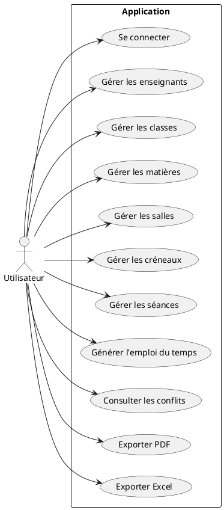

---

# 8 Diagramme de classes

## 8.1 Description des classes

L’application compte les classes Python suivantes :

- `BaseModel`
- `User`
- `Enseignant`
- `Classe`
- `Matiere`
- `Salle`
- `Creneau`
- `Seance`
- `EntityController`
- `AuthService`
- `ScheduleGenerator`
- `ConflictDetector`
- `ExportService`
- `StatisticsService`

### 8.1.1 Attributs et méthodes

#### BaseModel
- Attributs : `id`
- Méthodes : `save()`, `delete()`, `to_dict()`
- Rôle : classe abstraite fournissant des opérations ORM réutilisables.

#### User
- Attributs : `nom`, `prenom`, `email`, `password`, `role`
- Méthodes : `__repr__()`
- Rôle : représente un utilisateur authentifié de l’application.

#### Enseignant
- Attributs : `nom`, `prenom`, `email`, `telephone`, `specialite`, `disponibilite`
- Méthodes : `__repr__()`
- Associations : `seances` relation vers `Seance`
- Rôle : stocke les données des enseignants et leurs disponibilités.

#### Classe
- Attributs : `nom`, `niveau`, `effectif`
- Méthodes : `__repr__()`
- Associations : `seances` relation vers `Seance`
- Rôle : décrit une promotion ou groupe d’élèves.

#### Matiere
- Attributs : `nom`, `volume_horaire`
- Méthodes : `__repr__()`
- Associations : `seances`
- Rôle : définit un cours à affecter au planning.

#### Salle
- Attributs : `nom`, `type`, `capacite`
- Méthodes : `__repr__()`
- Associations : `seances`
- Rôle : représente une salle disponible pour les séances.

#### Creneau
- Attributs : `jour`, `heure_debut`, `heure_fin`
- Méthodes : `__repr__()`
- Associations : `seances`
- Rôle : définit un intervalle temporel.

#### Seance
- Attributs : `classe_id`, `enseignant_id`, `matiere_id`, `salle_id`, `creneau_id`
- Méthodes : `__repr__()`
- Associations : relations vers `Classe`, `Enseignant`, `Matiere`, `Salle`, `Creneau`
- Rôle : représente une ligne de planning.

#### EntityController
- Méthodes : `list_all()`, `paginate()`, `get_by_id()`, `create()`, `update()`, `delete()`
- Rôle : fournisseur générique de logique CRUD.

#### AuthService
- Méthodes : `hash_password()`, `check_password()`, `authenticate()`
- Rôle : authentification et gestion des mots de passe.

#### ScheduleGenerator
- Méthodes : `generate()`, `clear_seances()`, `_build_available_slots()`, `_assign_courses()`, `_find_teacher_for_subject()`, `_find_room()`, `_has_teacher_conflict()`, `_has_room_conflict()`, `_has_classe_conflict()`
- Rôle : moteur de génération automatique de planning.

#### ConflictDetector
- Méthodes : `detect_conflicts()`
- Rôle : recherche et classification des conflits du planning.

#### ExportService
- Méthodes : `generate_excel()`, `generate_pdf()`
- Rôle : création d’exports Excel et PDF.

#### StatisticsService
- Méthodes : `count_enseignants()`, `count_classes()`, `count_matieres()`, `count_salles()`, `count_seances()`, `occupation_salles()`, `occupation_enseignants()`, `volume_horaire_par_matiere()`
- Rôle : calcul des indicateurs du tableau de bord.

## 8.2 Diagramme de classes PlantUML

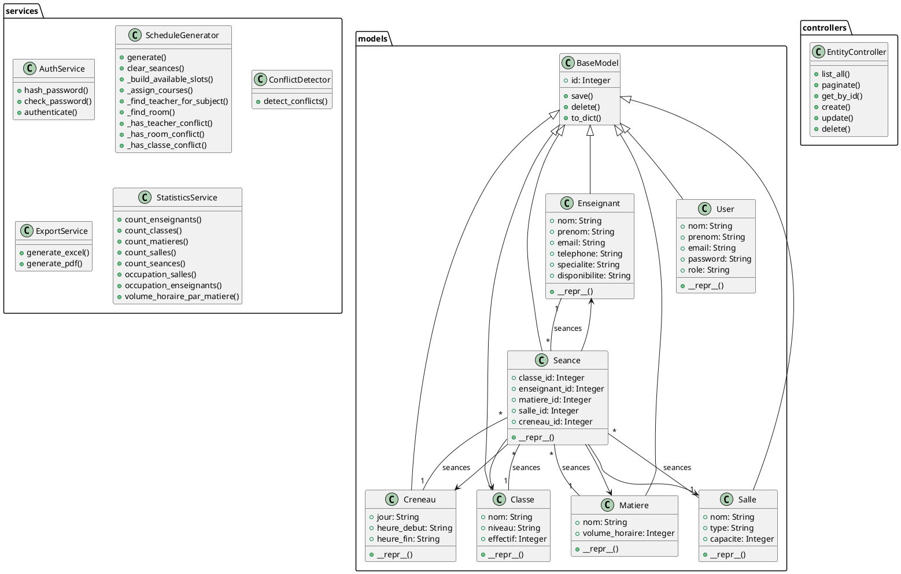

---

# 9 Diagrammes de séquence

## 9.1 Connexion

Description : Le flux de connexion récupère les identifiants depuis le formulaire, les transmet au service d’authentification, et stocke les informations utilisateur en session.

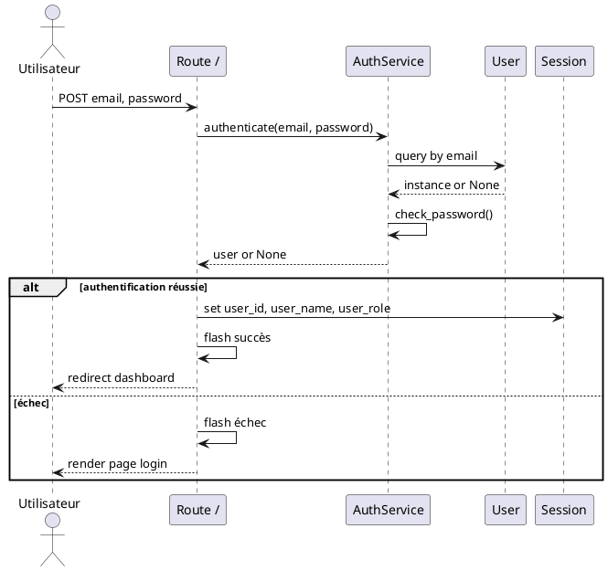

## 9.2 Ajouter un enseignant

Description : L’ajout d’un enseignant passe par le formulaire de création et le contrôleur générique `EntityController`.

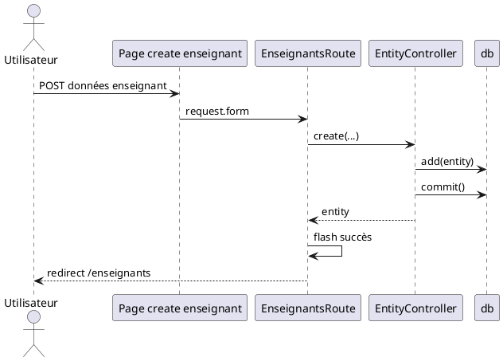

## 9.3 Modifier une classe

Description : La modification d’une classe se fait via l’édition du formulaire et la méthode `update()`.

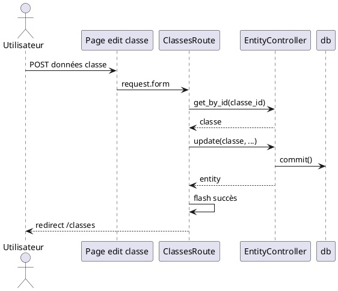

## 9.4 Générer un emploi du temps

Description : Le générateur de planning efface les séances existantes, construit une carte des créneaux disponibles, puis tente d’assigner matière, enseignant et salle.

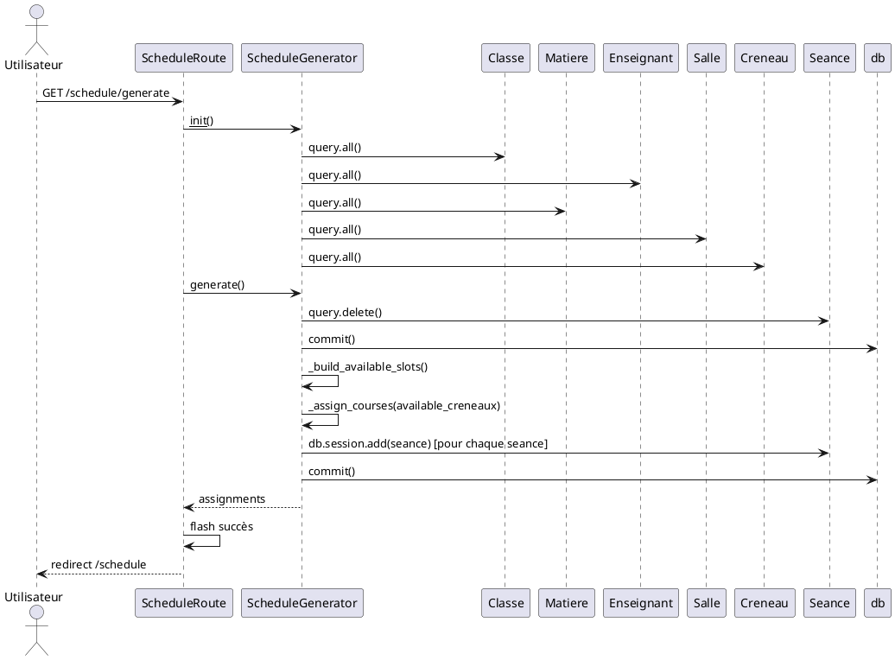

## 9.5 Détection des conflits

Description : Le service parcourt toutes les séances et détecte les conflits de même créneau pour enseignant, salle, classe et créneau.

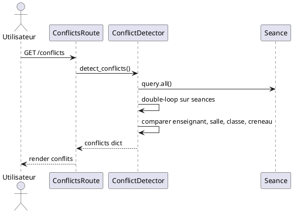

## 9.6 Export PDF

Description : L’export PDF parcourt le planning et construit un fichier PDF via FPDF.

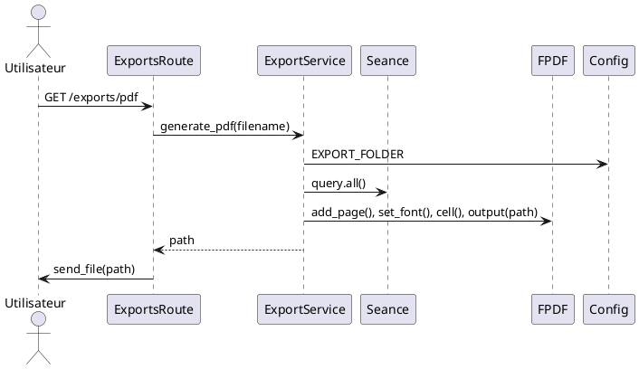

## 9.7 Export Excel

Description : L’export Excel utilise pandas et openpyxl pour créer un classeur contenant toutes les séances.

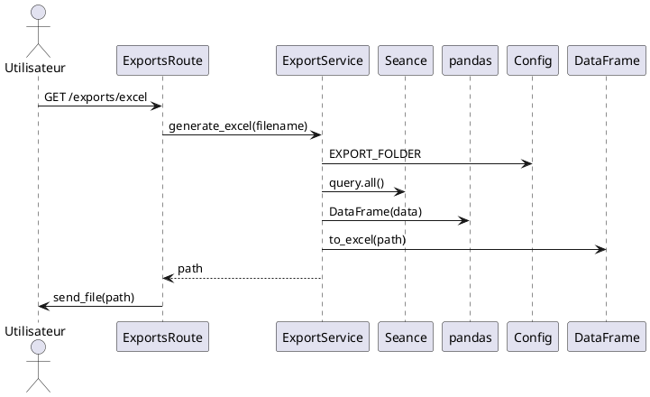

---

# 10 Diagramme d'activité

## 10.1 Génération des emplois du temps

Le diagramme d’activité représente le processus de génération d’emploi du temps : initialisation, nettoyage des séances, construction de la disponibilité, recherche de créneaux, affectation des matières, des enseignants et des salles, puis validation.

```plantuml
@startuml
start
:Initialiser ScheduleGenerator;
:Charger classes, enseignants, matières, salles, créneaux;
:Supprimer toutes les séances existantes;
:Construire available_creneaux par enseignant et créneau;
for (chaque classe) {
  :Calculer needed_hours par matière;
  for (chaque créneau) {
    if (toutes les matières assignées?) then (oui)
      break
    endif
    if (classe a conflit sur créneau?) then (oui)
      continue
    endif
    for (chaque matière restante) {
      if (matière demandée) then (oui)
        :Rechercher enseignant disponible;
        :Rechercher salle disponible;
        if (enseignant et salle trouvés) then (oui)
          :Créer et enregistrer la séance;
          :Décrémenter needed_hours;
          break
        endif
      endif
    }
  }
}
:Commit des séances;
stop
@enduml
```

---

# 11 Diagramme d'état

## 11.1 État d’une séance

Ce diagramme présente l’état d’une séance tout au long de son cycle de vie dans l’application.

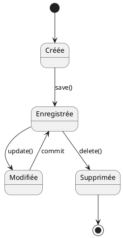

---

# 12 Diagramme de composants

## 12.1 Description

Le diagramme de composants reflète l’architecture réelle de l’application Flask. Il montre les blueprints de route, les services métier, le module ORM et les ressources statiques.

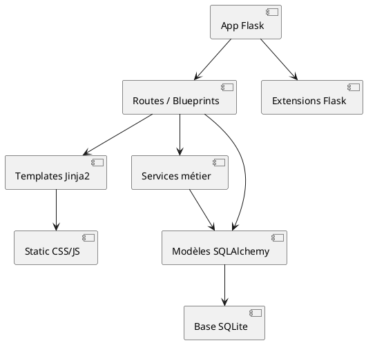

---

# 13 Diagramme de déploiement

## 13.1 Description

Le déploiement repose sur une application Flask exécutée en local ou sur un serveur WSGI, avec une base de données SQLite stockée dans le dossier `instance`.

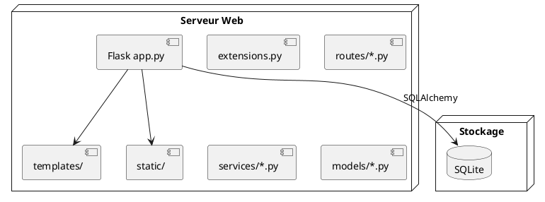

---

# 14 Architecture du projet

## 14.1 Architecture MVC

L’application suit une architecture proche du modèle MVC (Model-View-Controller) adaptée à Flask.

- Models : représentés par les classes SQLAlchemy dans `models/`.
- Views : templates Jinja2 dans `templates/`.
- Controllers : blueprints dans `routes/` et logique CRUD via `controllers/entity_controller.py`.
- Services : classes métier dans `services/`.

## 14.2 Contrôleurs

Les contrôleurs sont implémentés sous forme de blueprints Flask dans `routes/`. Chaque blueprint gère un ensemble de routes pour une ressource : `enseignants`, `classes`, `matieres`, `salles`, `creneaux`, `seances`, `schedule`, `conflicts`, `exports`, `dashboard`, `auth`.

## 14.3 Modèles

Les modèles représentent la structure des données stockées en base. Tous utilisent `BaseModel` pour partager des opérations CRUD.

## 14.4 Routes

Les routes exposent des endpoints HTTP accessibles à un utilisateur authentifié. Elles effectuent la validation minimale des formulaires et délèguent au contrôleur ou service métier.

## 14.5 Services

Les services contiennent la logique spécifique hors des routes : authentification (`AuthService`), génération de planning (`ScheduleGenerator`), détection de conflits (`ConflictDetector`), export (`ExportService`) et statistiques (`StatisticsService`).

## 14.6 Templates

Les templates Jinja2 fournissent l’interface utilisateur. Ils utilisent `layout.html` comme base, `partials/sidebar.html` pour la navigation et `partials/navbar.html` pour le header.

## 14.7 Static

Les ressources statiques sont :

- CSS : `static/css/styles.css`
- JavaScript : `static/js/main.js`

## 14.8 Arbre du projet

```
emploi_du_temps/
├── app.py
├── config.py
├── controllers/
│   ├── base_controller.py
│   └── entity_controller.py
├── extensions.py
├── models/
│   ├── __init__.py
│   ├── base.py
│   ├── classe.py
│   ├── creneau.py
│   ├── enseignant.py
│   ├── matiere.py
│   ├── salle.py
│   ├── seance.py
│   └── user.py
├── routes/
│   ├── auth.py
│   ├── classes.py
│   ├── conflicts.py
│   ├── creneaux.py
│   ├── dashboard.py
│   ├── enseignants.py
│   ├── exports.py
│   ├── matieres.py
│   ├── schedule.py
│   ├── salles.py
│   └── seances.py
├── services/
│   ├── auth_service.py
│   ├── conflict_service.py
│   ├── export_service.py
│   ├── schedule_service.py
│   └── statistics_service.py
├── static/
│   ├── css/
│   │   └── styles.css
│   └── js/
│       └── main.js
├── templates/
│   ├── auth/login.html
│   ├── classes/create.html
│   ├── classes/edit.html
│   ├── classes/index.html
│   ├── conflicts/index.html
│   ├── creneaux/create.html
│   ├── creneaux/edit.html
│   ├── creneaux/index.html
│   ├── dashboard/index.html
│   ├── enseignant/create.html
│   ├── enseignant/edit.html
│   ├── enseignant/index.html
│   ├── layout.html
│   ├── matieres/create.html
│   ├── matieres/edit.html
│   ├── matieres/index.html
│   ├── schedule/index.html
│   ├── seances/create.html
│   ├── seances/edit.html
│   ├── seances/index.html
│   ├── salles/create.html
│   ├── salles/edit.html
│   ├── salles/index.html
│   ├── 404.html
│   └── 500.html
├── requirements.txt
├── README.md
├── tests/
│   ├── conftest.py
│   ├── test_app.py
│   ├── test_csrf.py
│   └── test_csrf_multiple.py
└── instance/
    └── database.db
```

---

# 15 Base de données

## 15.1 Analyse SQLAlchemy

Les tables sont définies via SQLAlchemy et héritent de `BaseModel`.

### 15.1.1 Tables et rôles

- `users` : gestion des utilisateurs avec rôle.
- `enseignants` : stockage des enseignants et disponibilités.
- `classes` : définition des promotions et effectifs.
- `matieres` : cours et volumes horaires.
- `salles` : information des salles et capacités.
- `creneaux` : plage de temps et jour.
- `seances` : association des éléments du planning.

## 15.2 Description des tables

### users
- rôle : comptes utilisateurs du système.
- attributs : `id`, `nom`, `prenom`, `email`, `password`, `role`
- clé primaire : `id`
- contraintes : `email` unique, `nom`, `prenom`, `email`, `password` non null.

### enseignants
- rôle : référence des enseignants.
- attributs : `id`, `nom`, `prenom`, `email`, `telephone`, `specialite`, `disponibilite`
- clé primaire : `id`
- contraintes : `email` unique, `nom`, `prenom`, `email` non null.

### classes
- rôle : groupes d’élèves.
- attributs : `id`, `nom`, `niveau`, `effectif`
- clé primaire : `id`
- contraintes : `nom`, `niveau`, `effectif` non null.

### matieres
- rôle : cours à planifier.
- attributs : `id`, `nom`, `volume_horaire`
- clé primaire : `id`
- contraintes : `nom`, `volume_horaire` non null.

### salles
- rôle : ressources physiques pour les séances.
- attributs : `id`, `nom`, `type`, `capacite`
- clé primaire : `id`
- contraintes : `nom`, `type`, `capacite` non null.

### creneaux
- rôle : périodes horaires.
- attributs : `id`, `jour`, `heure_debut`, `heure_fin`
- clé primaire : `id`
- contraintes : `jour`, `heure_debut`, `heure_fin` non null.

### seances
- rôle : entrée de planning reliant les autres entités.
- attributs : `id`, `classe_id`, `enseignant_id`, `matiere_id`, `salle_id`, `creneau_id`
- clé primaire : `id`
- clés étrangères : `classe_id` -> `classes.id`, `enseignant_id` -> `enseignants.id`, `matiere_id` -> `matieres.id`, `salle_id` -> `salles.id`, `creneau_id` -> `creneaux.id`
- contraintes : toutes les références sont non null.

## 15.3 MCD

Entités :

- Enseignant
- Classe
- Matière
- Salle
- Créneau
- Séance

Relations :

- Une `Séance` associe une `Classe`, un `Enseignant`, une `Matière`, une `Salle`, un `Créneau`.
- Une `Classe` peut avoir plusieurs `Séances`.
- Un `Enseignant` peut avoir plusieurs `Séances`.
- Une `Matière` peut être présente dans plusieurs `Séances`.
- Une `Salle` peut accueillir plusieurs `Séances`.
- Un `Créneau` peut être utilisé par plusieurs `Séances`.

## 15.4 MLD

- users(id, nom, prenom, email, password, role)
- enseignants(id, nom, prenom, email, telephone, specialite, disponibilite)
- classes(id, nom, niveau, effectif)
- matieres(id, nom, volume_horaire)
- salles(id, nom, type, capacite)
- creneaux(id, jour, heure_debut, heure_fin)
- seances(id, classe_id, enseignant_id, matiere_id, salle_id, creneau_id)

## 15.5 Schéma relationnel

- `seances.classe_id` référencie `classes.id`
- `seances.enseignant_id` référencie `enseignants.id`
- `seances.matiere_id` référencie `matieres.id`
- `seances.salle_id` référencie `salles.id`
- `seances.creneau_id` référencie `creneaux.id`

## 15.6 Schéma relationnel PlantUML

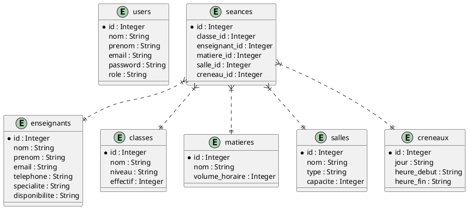

---

# 16 Algorithme de génération

## 16.1 Logique utilisée

Le moteur de génération `ScheduleGenerator` effectue les opérations suivantes :

1. suppression de toutes les séances existantes,
2. chargement des classes, enseignants, matières, salles et créneaux,
3. construction d’une carte de disponibilité des enseignants par créneau,
4. tri des créneaux et des matières,
5. pour chaque classe, tentatives d’affectation de matières à des créneaux libres,
6. recherche d’un enseignant disponible et d’une salle adaptée au niveau d’effectif,
7. création de la séance et mise à jour des heures restantes.

## 16.2 Pseudo-code

```text
function generate():
  clear_seances()
  available_creneaux = build_available_slots()
  sort creneaux par jour
  sort matieres par volume_horaire décroissant
  for each classe:
    needed_hours = {matiere.id: matiere.volume_horaire}
    for each creneau:
      if all needed_hours <= 0: break
      if classe a séance sur creneau: continue
      for each matiere in matieres:
        if needed_hours[matiere.id] <= 0: continue
        enseignant_id = trouver enseignant disponible pour matiere et creneau
        salle_id = trouver salle disponible pour classe et creneau
        if enseignant_id and salle_id:
          create Seance(classe, enseignant, matiere, salle, creneau)
          needed_hours[matiere.id] -= 1
          break
  commit
```

## 16.3 Complexité

La complexité est approximativement O(C * K * M * E + S) où :

- C : nombre de classes,
- K : nombre de créneaux,
- M : nombre de matières,
- E : nombre d’enseignants,
- S : nombre de séances pour la détection de conflits ou l’ajout en base.

La boucle imbriquée sur classes, créneaux et matières est la source principale de complexité.

## 16.4 Contraintes respectées

Contraintes prises en compte :

- un enseignant ne peut être affecté qu’à une séance par créneau,
- une salle ne peut accueillir qu’une séance par créneau,
- une classe ne peut avoir qu’une séance par créneau,
- une salle choisie doit avoir une capacité supérieure ou égale à l’effectif de la classe,
- la disponibilité de l’enseignant est comparée au jour du créneau.

Contraintes non prises en compte explicitement :

- association matière/enseignant spécifique,
- équilibres de charge par enseignant,
- gestion d’horaires fractionnés ou de durées multiples.

---

# 17 Détection des conflits

## 17.1 Conflit enseignant

Un conflit enseignant est identifié lorsque deux séances différentes partagent le même enseignant et le même créneau.

## 17.2 Conflit salle

Un conflit salle survient lorsque deux séances différentes utilisent la même salle et le même créneau.

## 17.3 Conflit classe

Un conflit classe est relevé lorsqu’une même classe est affectée à plusieurs séances sur un même créneau.

## 17.4 Conflit créneau

Le service détecte également les séances partageant le même créneau. Dans le code, la catégorie `creneau` liste tous les couples de séances qui ont une correspondance de créneau, indépendamment de l’entité partagée.

---

# 18 Description des principales classes

## 18.1 BaseModel

- rôle : abstraction commune pour les entités SQLAlchemy.
- responsabilités : fournir `save`, `delete`, `to_dict`.
- interactions : utilisé par tous les modèles héritant de `BaseModel`.

## 18.2 User

- rôle : utilisateur du système.
- responsabilités : stocker les informations de connexion.
- interactions : utilisé par `AuthService` et les sessions Flask.

## 18.3 Enseignant

- rôle : représenter un enseignant.
- responsabilités : conserver la disponibilité et appartenir aux séances.
- interactions : relation `seances`, utilisé dans le planning et les statistiques.

## 18.4 Classe

- rôle : regrouper des élèves.
- responsabilités : définir le niveau et l’effectif.
- interactions : relation `seances`, utilisé pour la génération et l’affichage du planning.

## 18.5 Matiere

- rôle : cours programmé.
- responsabilités : fournir le volume horaire.
- interactions : matché aux séances.

## 18.6 Salle

- rôle : ressource matérielle.
- responsabilités : caractériser la capacité et le type.
- interactions : sélectionnée par le générateur en fonction de l’effectif.

## 18.7 Creneau

- rôle : fenêtre temporelle.
- responsabilités : indiquer le jour et les horaires.
- interactions : élément central pour l’affectation des séances.

## 18.8 Seance

- rôle : unité du planning.
- responsabilités : relier classe, enseignant, matière, salle et créneau.
- interactions : point central des pages `schedule`, `conflicts` et exports.

## 18.9 EntityController

- rôle : gestion générique des opérations CRUD.
- responsabilités : simplifier la création, la lecture, la mise à jour et la suppression d’entités.
- interactions : utilisé par les routes des entités.

## 18.10 ScheduleGenerator

- rôle : calcul de la planification.
- responsabilités : effacer les séances existantes, construire les affectations et vérifier les conflits élémentaires.
- interactions : manipule `Classe`, `Enseignant`, `Matiere`, `Salle`, `Creneau`, `Seance`.

## 18.11 ConflictDetector

- rôle : analyse des conflits.
- responsabilités : rechercher les collisions par enseignant, salle, classe et créneau.
- interactions : parcourt l’ensemble des `Seance`.

## 18.12 ExportService

- rôle : génération de fichiers exportables.
- responsabilités : créer un fichier PDF et un fichier Excel mémorisés dans `exports/`.
- interactions : consulte les séances et accède à `Config`.

## 18.13 StatisticsService

- rôle : fournir des indicateurs pour le tableau de bord.
- responsabilités : compter les entités et calculer les occupations.
- interactions : utilisé par la route dashboad.

---

# 19 Description des interfaces

Pour chaque page, l’objectif est décrit et un emplacement de capture est prévu.

## 19.1 Page de connexion

Objectif : authentifier l’utilisateur et lui permettre d’accéder à l’interface d’administration.


## 19.2 Tableau de bord

Objectif : fournir une vue synthétique des statistiques et un accès à la génération de planning.


## 19.3 Gestion des enseignants

Objectif : lister, créer, modifier et supprimer les enseignants.


## 19.4 Gestion des classes

Objectif : gérer les classes et leurs effectifs.


## 19.5 Gestion des matières

Objectif : enregistrer les matières et leur volume horaire.


## 19.6 Gestion des salles

Objectif : gérer les ressources matérielles.


## 19.7 Gestion des créneaux

Objectif : définir les créneaux de planning.


## 19.8 Gestion des séances

Objectif : créer et administrer les séances manuellement.


## 19.9 Emploi du temps

Objectif : afficher le planning généré et proposer les exports.


## 19.10 Conflits

Objectif : visualiser les conflits détectés selon différents critères.


---

# 20 Fonctionnalités

## 20.1 Authentification

L’authentification est gérée via le blueprint `routes/auth.py`. La saisie d’un email et d’un mot de passe est vérifiée par `AuthService.authenticate()`, qui utilise `bcrypt` pour comparer le mot de passe fourni au hachage stocké.

## 20.2 Tableau de bord

Le tableau de bord affiche des compteurs d’entités et des graphiques Chart.js basés sur les données renvoyées par `StatisticsService`.

## 20.3 CRUD

L’application propose des opérations CRUD pour :

- enseignants,
- classes,
- matières,
- salles,
- créneaux,
- séances.

Ces opérations sont réalisées via `EntityController` et des formulaires HTML.

## 20.4 Recherche

La recherche est implémentée sur plusieurs pages par un paramètre `q` passé en query string. Les routes filtrent les résultats via SQLAlchemy ou par filtrage Python en mémoire.

## 20.5 Statistiques

Le dashboard présente :

- nombre d’enseignants,
- nombre de classes,
- nombre de matières,
- nombre de salles,
- nombre de séances,
- occupation des salles,
- occupation des enseignants,
- volume horaire par matière.

## 20.6 Génération

La génération automatique consomme les ressources existantes et crée des séances en évitant les conflits élémentaires.

## 20.7 Export

L’export Excel est créé avec `pandas.DataFrame.to_excel()`. L’export PDF est formaté via FPDF et écrit ligne par ligne avec une table simple.

## 20.8 Impression

L’application ne propose pas une fonctionnalité d’impression dédiée dans le code source. Les exports PDF et Excel constituent la principale sortie imprimable.

---

# 21 Sécurité

## 21.1 Hash des mots de passe

Les mots de passe sont hachés avec `bcrypt` dans `AuthService.hash_password()` et vérifiés avec `check_password()`.

## 21.2 Validation

La validation des données repose sur la conversion explicite des champs de formulaire (`int(...)`) et la présence de champs requis. Il n’existe pas de validation WTForms complète dans le code.

## 21.3 ORM

L’utilisation de Flask-SQLAlchemy limite les risques de SQL Injection et facilite la gestion de la base de données.

## 21.4 Protection SQL Injection

Les requêtes sont majoritairement formulées via SQLAlchemy ORM, ce qui protège contre l’injection SQL.

## 21.5 Gestion des erreurs

L’application définit des handlers pour les erreurs `404` et `500`. Les messages flash sont employés pour informer l’utilisateur des résultats d’action.

---

# 22 Technologies utilisées

| Technologie | Usage |
| --- | --- |
| Python | Langage principal |
| Flask | Framework web |
| Flask-SQLAlchemy | ORM |
| SQLAlchemy | Modélisation des données |
| Flask-WTF / CSRF | Protection formulaire |
| SQLite | Base de données embarquée |
| Bootstrap 5 | Interface utilisateur |
| Chart.js | Visualisation graphique |
| pandas | Génération Excel |
| openpyxl | Support Excel |
| FPDF | Export PDF |
| bcrypt | Hachage de mot de passe |
| Jinja2 | Templates HTML |

---

# 23 Difficultés rencontrées

- la mise en place d’un générateur de planning cohérent avec des contraintes multiples,
- l’équilibre entre simplicité de l’algorithme et exhaustivité des règles métier,
- la gestion de la disponibilité des enseignants à partir d’un champ texte `disponibilite`, qui n’est pas normalisée,
- l’absence d’une gestion complète des utilisateurs au-delà du rôle admin.

---

# 24 Améliorations futures

- implémenter un modèle `Elève` et un accès spécifique pour les étudiants,
- ajouter une validation de formulaire plus robuste avec WTForms,
- normaliser les disponibilités des enseignants en entités dédiées,
- enrichir l’algorithme de génération avec des contraintes de matière/enseignant,
- proposer un planning par classe et par enseignant sous forme matricielle,
- développer une authentification multi-rolée et un système de permissions,
- ajouter une recherche asynchrone réellement AJAX,
- améliorer le format PDF pour la pagination et la lisibilité.

---

# 25 Conclusion

Ce rapport présente une analyse complète de l’application de gestion des emplois du temps. La solution s’appuie sur une architecture modulaire Flask, une base SQLite et des services métiers dédiés. Le projet atteint les fonctions principales de génération, de détection de conflits et d’export, tout en laissant des axes d’amélioration pour un produit plus robuste.

---

# 26 Annexes

## 26.1 Structure du projet

Voir la section 14.8 pour l’arbre complet du projet.

## 26.2 Dépendances Python

Contenu de `requirements.txt` :

- Flask>=2.3
- Flask-WTF>=1.1
- SQLAlchemy>=2.0
- Flask-SQLAlchemy>=3.0
- Werkzeug>=3.0
- bcrypt>=4.0
- WTForms>=3.0
- pandas>=2.0
- openpyxl>=3.0
- fpdf>=1.7
- python-dotenv>=1.0

## 26.3 requirements.txt

Le fichier `requirements.txt` est disponible à la racine du projet.

## 26.4 Captures

Présenter ici les captures d’écran de l’interface pour chaque page décrite précédemment.
